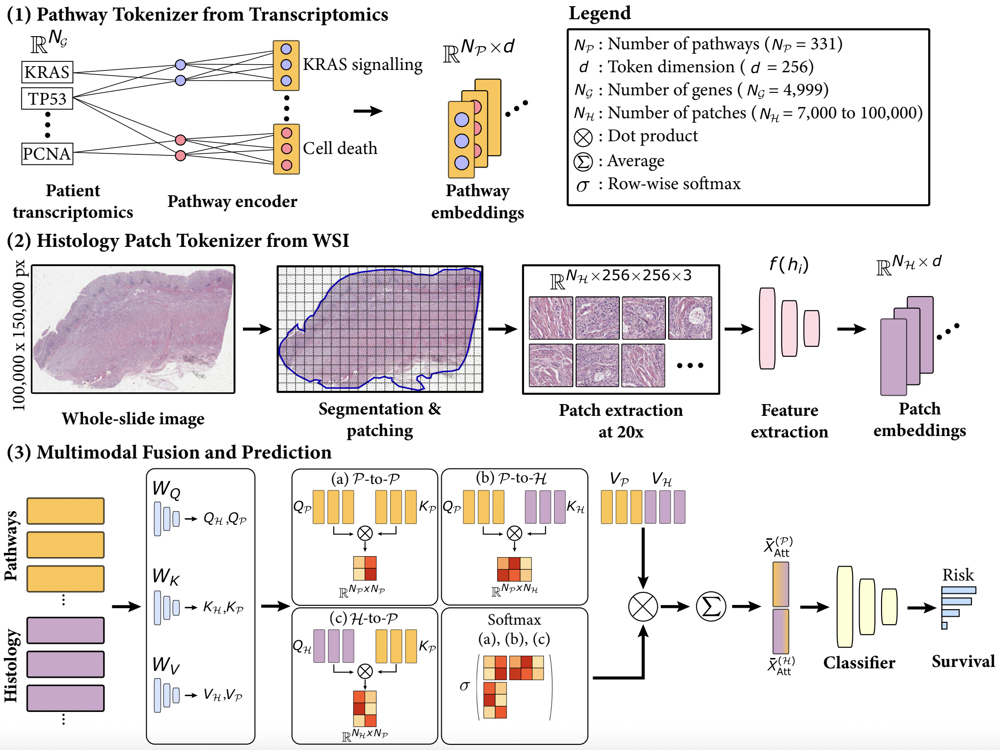

# Code for Modeling Dense Multimodal Interactions Between Biological Pathways and Histology for Survival Prediction

Welcome to the official GitHub repository for our CVPR 2024 paper, "Modeling Dense Multimodal Interactions Between Biological Pathways and Histology for Survival Prediction". This project was developed by the [Mahmood Lab](https://faisal.ai/) at Harvard Medical School and Brigham and Women's Hospital. Preprint can be accessed [here](https://arxiv.org/abs/2304.06819).



## Highlights
In our study, we explore the integration of whole-slide images (WSIs) and bulk transcriptomics to enhance patient survival prediction and interpretability. We focus on addressing two key challenges: (1) devising a method for meaningful tokenization of transcriptomics data and (2) capturing dense multimodal interactions between WSIs and transcriptomics. Our proposed model, *SurvPath*, leverages biological pathway tokens from transcriptomics and histology patch tokens from WSIs, facilitating memory-effective fusion through a multimodal Transformer. SurvPath surpasses unimodal and multimodal baselines across five datasets from The Cancer Genome Atlas, showcasing state-of-the-art performance. Furthermore, our interpretability framework identifies critical multimodal prognostic factors, offering deeper insights into genotype-phenotype interactions and underlying biological mechanisms.

## Installation Guide for Linux (using anaconda)
### Pre-requisities: 
- Linux (Tested on Ubuntu 18.04)
- NVIDIA GPU (Tested on Nvidia GeForce RTX 2080 Ti x 16) with CUDA 11.0 and cuDNN 7.5
- Python (3.8.13), h5py (2.10.0), matplotlib (3.6.3), numpy (1.21.6), opencv-python (4.5.1.48), openslide-python (1.2.0), openslide (3.4.1), pandas (1.4.2), pillow (9.0.1), PyTorch (1.6.5), scikit-learn (1.2.1), scipy (1.9.0), torchvision (0.13.1), captum (0.6.0), shap (0.41.0)

### Downloading TCGA Data and Pathways Compositions 
To download diagnostic WSIs (formatted as .svs files), molecular feature data and other clinical metadata, please refer  to the [NIH Genomic Data Commons Data Portal](https://portal.gdc.cancer.gov)and the [cBioPortal](https://www.cbioportal.org/). WSIs for each cancer type can be downloaded using the [GDC Data Transfer Tool](https://docs.gdc.cancer.gov/Data_Transfer_Tool/Users_Guide/Data_Download_and_Upload/). To get the pathway compositions for 50 Hallmarks, refer to [MsigDB](https://www.gsea-msigdb.org/gsea/msigdb/human/genesets.jsp?collection=H). To get the Reactome pathway compositions, refer to [PARADIGM](http://paradigm.five3genomics.com)

## Processing Whole Slide Images 
To process Whole Slide Images (WSIs), first, the tissue regions in each biopsy slide are segmented using Otsu's Segmentation on a downsampled WSI using OpenSlide. The 256 x 256 patches without spatial overlapping are extracted from the segmented tissue regions at the desired magnification. Consequently, an SSL pretrained Swin Transformer [CTransPath](https://github.com/Xiyue-Wang/TransPath) is used to encode raw image patches into 768-dim feature vectors, which we then save as .pt files for each WSI. The extracted features then serve as input (in a .pt file) to the network. All pre-processing of WSIs is done using the [CLAM toolbox](https://github.com/mahmoodlab/CLAM).

## Transcriptomics and Pathway Compositions
We downloaded raw RNA-seq abundance data for the TCGA cohorts from the [Xena database](https://www.nature.com/articles/s41587-020-0546-8) and performed normalization in the dataset class. The raw data is included as CSV files [`datasets_csv`](https://github.com/ajv012/SurvPath/tree/main/datasets_csv/raw_rna_data/combine). Xena database was also used to access disease specific survival and associated censorhsip. Using the Reactome and MSigDB Hallmarks pathway compositions, we selected pathways that had more than 90% of transcriptomics data available. The compositions can be found at [`metadata`](https://github.com/ajv012/SurvPath/blob/main/datasets_csv/metadata/combine_signatures.csv).  

## Training-Validation Splits 
For evaluating the algorithm's performance, we  partitioned each dataset using 5-fold cross-validation (stratified by the site of histology slide collection). Splits for each cancer type are found in the [`splits`](https://github.com/ajv012/SurvPath/tree/main/splits/5foldcv) folder, which each contain **splits_{k}.csv** for k = 1 to 5. In each **splits_{k}.csv**, the first column corresponds to the TCGA Case IDs used for training, and the second column corresponds to the TCGA Case IDs used for validation. Slides from one case are not distributed across training and validation sets. Alternatively, one could define their own splits, however, the files would need to be defined in this format. The dataset loader for using these train-val splits are defined in the `return_splits` function in the `SurvivalDatasetFactory`.

## Running Experiments 
Refer to [`scripts`]([https://github.com/ajv012/SurvPath/tree/main/scripts](https://github.com/mahmoodlab/SurvPath/tree/main/scripts)) folder for source files to train SurvPath and the baselines presented in the paper. Refer to the paper to find the hyperparameters required for training. 

## Issues 
- The preferred mode of communication is via GitHub issues.
- If GitHub issues are inappropriate, email `avaidya@mit.edu` (and cc `gjaume@bwh.harvard.edu`). 
- Immediate response to minor issues may not be available.

## License and Usage 
If you find our work useful in your research, please consider citing our paper at:

```
@article{jaume2023modeling,
  title={Modeling Dense Multimodal Interactions Between Biological Pathways and Histology for Survival Prediction},
  author={Jaume, Guillaume and Vaidya, Anurag and Chen, Richard and Williamson, Drew and Liang, Paul and Mahmood, Faisal},
  journal={Proceedings of the IEEE/CVF Conference on Computer Vision and Pattern Recognition (CVPR)},
  year={2024}
}
```

[Mahmood Lab](https://faisal.ai) - This code is made available under the GPLv3 License and is available for non-commercial academic purposes.
